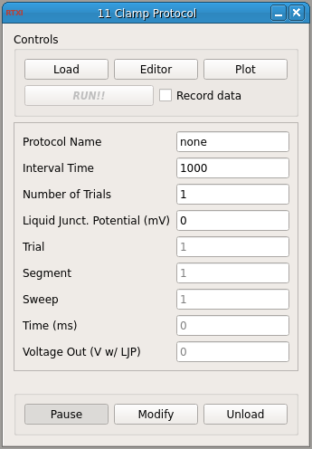
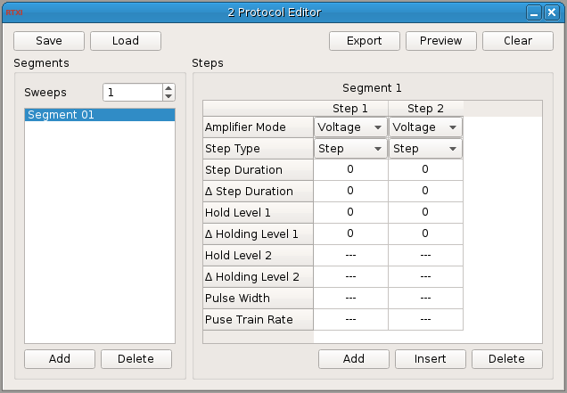
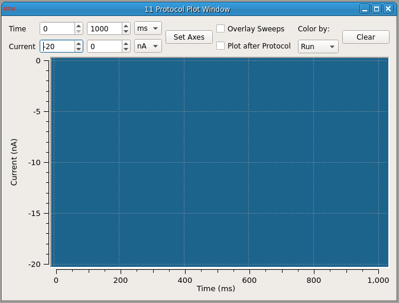

###Clamp Protocol

**Requirements:** None  
**Limitations:** None  

<!--start-->
Use this module to create and run custom clamp protocols. There are three components to the module:  
1. The main window  
2. The protocol editor  
3. The protocol window  

The main window opens and runs user-defined protocols. The editor is a widget that uses the built-in protocol class to create current/voltage steps, trains, or ramps. The window overlays traces of responses to protocol stimulation.  
<!--end-->

The key features of the main window are the capacity to load/unload protocols and open the protocol editor and protocol window widgets. The module can also trigger the data recorder, meaning that when a file is already open for saving in the data recorder module, running the clamp protocol module will write data to the recorder during each trial when the protocol is running.  

All protocols are saved in \*.csp files (which are basically XML), and contain three main components: steps, segments, and sweeps. Segments are components one level of abstraction lower than the protocol itself and comprise one or more steps. Sweeps refer to the number of times a protocol segment should be run. Protocols are loaded and edited in the protocol editor widget, displayed above, and the editor also contains a viewer. (To close the popup window, you can either right-click and close the window or hit `ESC`.)  

The clamp protocol window can be used in conjunction with the oscilloscope to visualize cell responses. The protocol window will plot overlays of signals, sorted at user discretion by trial #, sweep, or run #. If you are running a large, computationally intensive protocol, you should enable the buffering option (Plot after Protocol) to avoid wasting valuable time plotting things intead of running what you need.  

####Input Channels
1. input(0) - Current In : applied current  (A)

####Output Channels
1. output(0) - Voltage Out (V w/ LJP) : voltage with liquid junction potential (V)

####Parameters
1. Interval Time - Time allocated between intervals (when running N > 1 trials)
2. Number of Trials - Number of times the loaded protocol is applied
3. Liquid Junct. Potential - Liquid junction potential (mV)

####States
1. Segment - Number of the protocol segment currently being run
2. Sweep - Sweep number in the current segment
3. Time - Elapsed time for the current trial (ms)
4. Voltage Out - Voltage w/ liquid junction potential (same as output(0)) (V)

####Comments
1. Protocol Name - Name of the loaded protocol file
