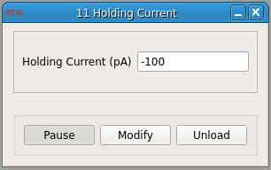

###Current Hold

**Requirements:** None  
**Limitations:** None  

<!--start-->
This module outputs a static value set by the user. Nothing else. This is an extremely simple module.  
<!--end-->

####Output Channels
1. output(0) : Command - current output set by the "Holding Current" parameter

####Parameters
1. Holding Current (pA) - current output from the module
