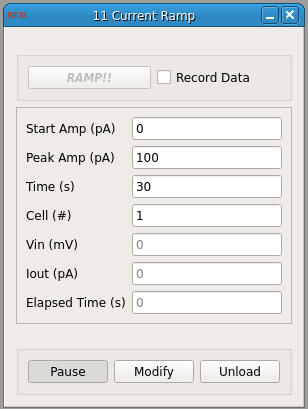

###Current Ramp

**Requirements:** None  
**Limitations:** None  

<!--start-->
Outputs a current ramp to the cell. The duration of the ramp (rise and fall) is set via the Time parameter, along with the starting and peak current for the ramp. The module, when the "RAMP!!!" button is pressed, will initiate the ramp. If the "Record data" checkbox is set and the data recorder is already open and ready to write channels to a file, starting the ramp will also record data for its duration. If the module is unpaused and a ramp button is inactive, then it simply reads in the voltage from the connected analog input.  
<!--end-->

####Input Channels
1. input(0) : Voltage in (V)

####Output Channels
1. output(0) : Current out (A)

####Parameters
1. Start Amp (pA) - Starting and ending current for the ramp.   
2. Peak Amp (pA) - Peak (at Time/2) of the ramp.  
3. Time (s)  
4. Cell (#) - Relic parameter from the v1.4 module. Use it if you like.  
5. Vin (mV) - Displays the voltage input in mV.  
6. Iout (pA) - Displays the current being injected in a ramp.  
7. Elapsed Time (s) - How long a ramp has been active.  
